# Vectors: Geometric View

## Definition of Vectors

> **Definition 1.1.1 Vectors**
> 
> Quantities that have both a **magnitude** (the "how much" or "how big" part) and a **direction** in space. The magnitude of a vector is also called its **norm** or **length**.

Regarding the notation of vectors, different books or authors have different habits. You may see **A** (boldface letter), $\overrightarrow{A}$ (with an arrow above), $\overrightarrow{\textbf{A}}$ (both boldface and arrow) etc. I will stick to $\overrightarrow{A}$, because I like using boldface letters to make readers pay attention to those words. Formally, we have:

- Position vector of point $A$ which starts at the origin: $\overrightarrow{OA}$. We denote its magnitude as $|\overrightarrow{OA}|$[^1] or $OA$.
- Displacement vector of $B$ relative to $A$: $\overrightarrow{AB}$. Its length is $|\overrightarrow{AB}|$.

Finally, we say **two vectors are equal** if they have the same magnitude and direction, and **the negative of a vector $\overrightarrow{a}$** is the vector parallel to $\overrightarrow{a}$ with the same length but in the opposite direction. It is denoted $-\overrightarrow{a}$.

## Basic Operations

In this part, I want to briefly talk about vector addition (subtraction) and vector multiplication by a scalar. As this is just a note, I will only give you some schematic diagrams[^2]:

    

        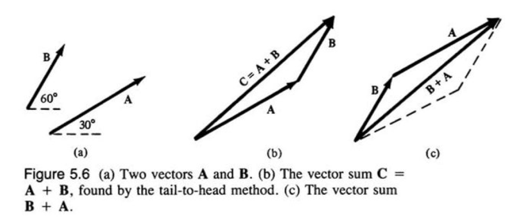
        
<em>Figure 1</em>

    

    

        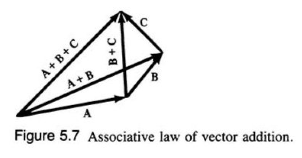
        
<em>Figure 2</em>

    

    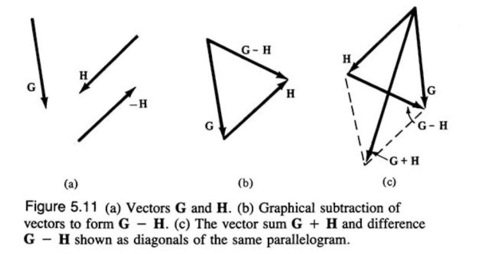
    
<em>Figure 3</em>

Pictures above show the way we perform vector addition or subtraction. An interesting fact is that $\overrightarrow{BA}$, which is the sum of two vectors, is a diagonal of a parallelogram. However, as Figure 3 shows, the subtraction is another diagonal.

For a vector multiplied by a scalar, it's just a stretching or compressing of the vector, omitted here. But one thing is important:

> Theorem 1.2.1: Parallel
>
>Two non-zero vectors are parallel if and only if one is a scalar multiple of the other, i.e.
> 
> $$\begin{equation}\overrightarrow{a} \parallel \overrightarrow{b} \Leftrightarrow \overrightarrow{a} = \lambda \overrightarrow{b}. \tag{1.1} \end{equation}$$

## The Scalar Product

> **Definition 1.3.1: The Scalar Product**
> 
> The scalar product, also called dot product or inner product of two vectors, say $\overrightarrow{a}, \overrightarrow{b}$ is defined as:
> 
> $$\begin{equation}\overrightarrow{a} \cdot \overrightarrow{b} = |\overrightarrow{a}||\overrightarrow{b}|\cos \theta\tag{1.2}\end{equation}$$
> Here, $\theta$ is the small angle between the two vectors (ranges from $0$ to $\pi$).

We have another definition: (forgive my laziness)

> **Definition 1.3.2: Components** [^3]

    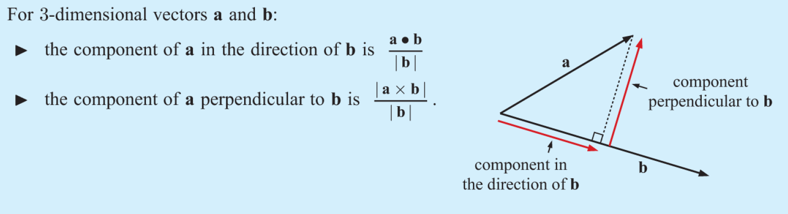
    
<em>Figure 4</em>

Please notice that a component is a scalar! If you want the vector along the direction of $\overrightarrow{b}$ with a magnitude as the component of $\overrightarrow{a}$ in the direction of $\overrightarrow{b}$, what you are searching for is a concept called projection:

> **Definition 1.3.3: Projection**
> 
> $$\begin{equation}\text{Projection of } \overrightarrow{a} \text{ onto } \overrightarrow{b} = \frac{\overrightarrow{a} \cdot \overrightarrow{b}}{|\overrightarrow{b}|}\overrightarrow{b}\tag{1.3}\end{equation}$$

There is a useful schematic diagram for the scalar product[^4]:

    

        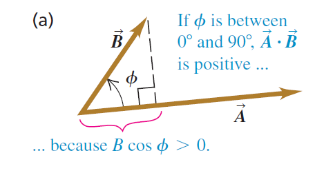
        
<em>Figure 5</em>

    

    

        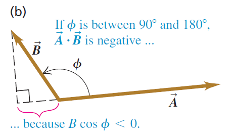
        
<em>Figure 6</em>

    

    

        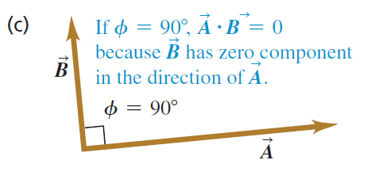
        
<em>Figure 7</em>

    

This shows that the sign of the scalar product reveals the angle between two vectors. If the value of the scalar product is positive, the angle will be acute; negative for an obtuse angle; 0 for a right angle. Actually, we have:

> Theorem 1.3.4: Angle between Vectors
>
> $$\begin{equation}\cos \theta = \frac{\overrightarrow{a} \cdot \overrightarrow{b}}{|\overrightarrow{a}||\overrightarrow{b}|}\tag{1.4}\end{equation}$$

Some special cases need us to pay more attention:

> Theorem 1.3.5: Perpendicular and Parallel
>
> $$\begin{align}\overrightarrow{a} \perp \overrightarrow{b} \Leftrightarrow \overrightarrow{a} \cdot \overrightarrow{b} = 0\tag{1.5}\\
> \overrightarrow{a} \parallel \overrightarrow{b} \Leftrightarrow|\overrightarrow{a} \cdot \overrightarrow{b}| = |\overrightarrow{a}||\overrightarrow{b}|\tag{1.6}\end{align}$$

We will see more applications of the scalar product when introducing the Cartesian coordinate system. Just wait and see.

## The Vector Product

> **Definition 1.4.1: The Vector Product**
> 
> We denote the vector product of two vectors $\overrightarrow{a}, \overrightarrow{b}$, also called cross product, by $\overrightarrow{a} \times \overrightarrow{b}$. The result of it is a vector, and we define it by defining its magnitude and direction:
> - **Magnitude:**
> 
> $$
> \begin{equation}\left|\overrightarrow{a} \times \overrightarrow{b}\right| = |\overrightarrow{a}||\overrightarrow{b}|\sin \theta \tag{1.7}\end{equation}$$
> - **Direction:** $\overrightarrow{a} \times \overrightarrow{b}$ is perpendicular to the plane formed by $\overrightarrow{a}$ and $\overrightarrow{b}$, using the **right-hand rule** to choose the final direction.

At first glance, the definition of vector product is kind of complex, but there are also helpful schematic diagrams[^5]:

    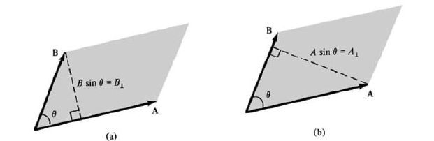
    
<em>Figure 8</em>

    

        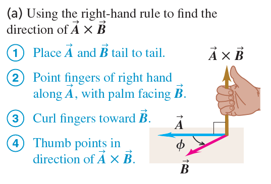
        
<em>Figure 9</em>

    

    

        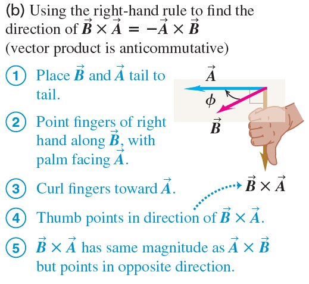
        
<em>Figure 10</em>

    

Figure 8 shows that the magnitude of the vector product is the area of the parallelogram "spanned" by the two vectors. Then Figures 9 and 10 show you how the right-hand rule works. Notice that I have been ignoring the rules of operations of vectors, like the commutative law of vector addition, etc. The reason is that most of them are like the rules for numbers. However, the only difference just showed up, we have:

> Theorem 1.4.2: Anticommutative Law of Vector Product
>
> $$
> \begin{equation}
>    \overrightarrow{a} \times \overrightarrow{b} = -\overrightarrow{b} \times \overrightarrow{a}\tag{1.8}
> \end{equation}$$

Vectors can be more applicable, but we have to bring something up here. Don't worry, it is Mr. Descartes who comes to help.

# Vectors with Cartesian Coordinate

## Introducing Cartesian Coordinates

I believe the readers are quite familiar with the Cartesian coordinate system, so I just want to show you two graphs of it[^6]:

    

        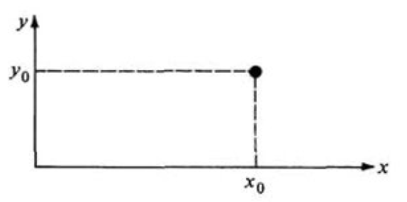
        
<em>Figure 11</em>

    

    

        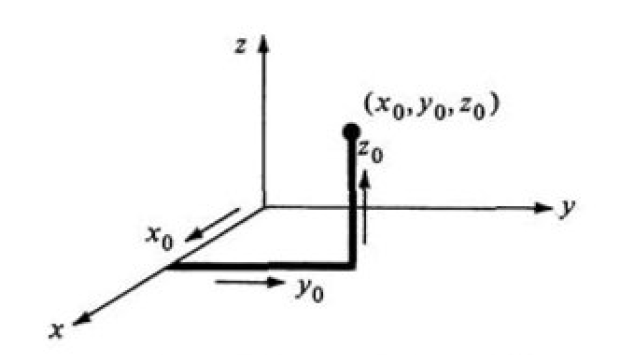
        
<em>Figure 12</em>

    

Here, only a little knowledge needs to be introduced:

> **Definition 2.1.1: Unit Vector and $\overrightarrow{i}, \overrightarrow{j}, \overrightarrow{k}$**
> 
> **A unit vector is a vector that has a magnitude of 1**, its only purpose is to point—that is, to describe a direction in space.
> 
> In an xy-coordinate system, we can define a unit vector $\overrightarrow{i}$ **that points in the direction of the positive x-axis** and a unit vector $\overrightarrow{j}$ **that points in the direction of the positive y-axis**. If we are dealing with a xyz-coordinate, we define a unit vector $\overrightarrow{k}$ **that points in the direction of the positive z-axis**.
> 
> 

>     

>         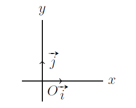
>         
<em>Figure 13</em>

>     

>     

>         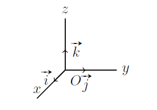
>         
<em>Figure 14</em>

>     

> 

## Converting

Now, a critical problem: if we know a vector, which means we know its magnitude and direction, how can we represent it in the Cartesian coordinate system? Here suppose the meaning of the direction of a vector is denoted by the angle between the vector and x-axis, which is $\theta$. This means we have[^7]:

    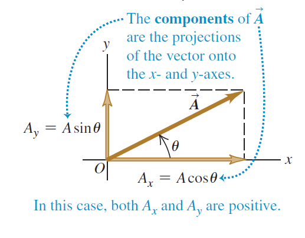
    
<em>Figure 15</em>

In the picture above, we have a vector $\overrightarrow{A}$ with magnitude $|\overrightarrow{A}|$, so it is easy to find its component on the x-axis is $|\overrightarrow{A}|\cos \theta$ and the component on the y-axis is $|\overrightarrow{A}|\sin \theta$. Thus, by vector addition we have:

$$
\begin{equation}
    \overrightarrow{A} = |\overrightarrow{A}|\cos \theta \overrightarrow{i} + |\overrightarrow{A}|\sin \theta \overrightarrow{j} \tag{2.1}
\end{equation}
$$

Then, we write[^8]:

$$
\begin{equation}
    \overrightarrow{A} = 
    \begin{pmatrix}
        |\overrightarrow{A}|\cos \theta \\
        |\overrightarrow{A}|\sin \theta
    \end{pmatrix}\tag{2.2}
\end{equation}
$$

Here, let $A_x = |\overrightarrow{A}|\cos \theta, A_y = |\overrightarrow{A}|\sin \theta$. By applying the Pythagorean theorem, we have:

> **Theorem 2.2.1: The Magnitude of Vectors**
> 
> $$\begin{equation} |\overrightarrow{A}| = \sqrt{A_x^2 + A_y^2}\tag{2.3}\end{equation}$$
> 
> It is not hard to see that in xyz-coordinates, the formula would be:
> 
> $$\begin{equation}|\overrightarrow{A}| = \sqrt{A_x^2 + A_y^2 + A_z^2}\tag{2.4}\end{equation}$$

A numerical example[^9]:

    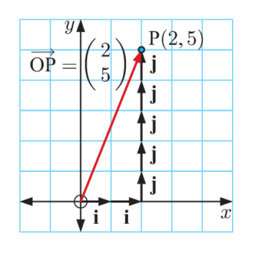
    
<em>Figure 16</em>

$$
\text{Here } \overrightarrow{OP} = 2\overrightarrow{i} + 5\overrightarrow{j}, \text{ hence } \overrightarrow{OP} =
\begin{pmatrix}
    2 \\
    5
\end{pmatrix}
\text{ and } |\overrightarrow{OP}| = \sqrt{2^2 + 5^2} = \sqrt{29}.
$$

What I mean by this subsection is that when we write a vector as something like

$$
\overrightarrow{A} = 
\begin{pmatrix}
  2 \\
  5
\end{pmatrix},
$$

what we really mean is that $\overrightarrow{A} = 2\overrightarrow{i} + 5\overrightarrow{j}$.

## "Translating"

We finally made it here. The final task is to "translate" things from the previous sections into coordinates.

Suppose we have three vectors:
$$
\overrightarrow{a} = 
\begin{pmatrix}
    a_1 \\
    a_2 \\
    a_3
\end{pmatrix},\quad
\overrightarrow{b} = 
\begin{pmatrix}
    b_1 \\
    b_2 \\
    b_3
\end{pmatrix},\quad
\overrightarrow{c} = 
\begin{pmatrix}
    c_1 \\
    c_2 \\
    c_3
\end{pmatrix}
$$

- $\overrightarrow{a} = \overrightarrow{b} \Leftrightarrow a_1 = b_1, a_2 = b_2, a_3 = b_3$
- $-\overrightarrow{a} = -\begin{pmatrix}
    a_1 \\
    a_2 \\
    a_3
\end{pmatrix} = \begin{pmatrix}
    -a_1 \\
    -a_2 \\
    -a_3
\end{pmatrix}$
- $\overrightarrow{a} + \overrightarrow{b} = \begin{pmatrix}
    a_1 + b_1 \\
    a_2 + b_2 \\
    a_3 + b_3
\end{pmatrix}$

Let me prove the third one to you:
$$
\overrightarrow{a} + \overrightarrow{b} = a_1 \overrightarrow{i} + a_2 \overrightarrow{j} + a_3 \overrightarrow{k} + b_1 \overrightarrow{i} + b_2 \overrightarrow{j} + b_3 \overrightarrow{k} \\
= (a_1 + b_1) \overrightarrow{i} + (a_2 + b_2) \overrightarrow{j} + (a_3 + b_3) \overrightarrow{k} \\
= \begin{pmatrix}
    a_1 + b_1 \\
    a_2 + b_2 \\
    a_3 + b_3
\end{pmatrix}
$$

The proof of other results usually follows the same idea, so I will just list the results here now:

- $\overrightarrow{a} \parallel \overrightarrow{b} \Leftrightarrow a_1 = \lambda b_1, a_2 = \lambda b_2, a_3 = \lambda b_3$
- $\overrightarrow{a} \cdot \overrightarrow{b} = a_1 b_1 + a_2 b_2 + a_3 b_3$
- $|\overrightarrow{a}| = \sqrt{\overrightarrow{a} \cdot \overrightarrow{a}} = \sqrt{a_1^2 + a_2^2 + a_3^2}$
- By the way, if we want to find a unit vector whose direction is the same as $\overrightarrow{a}$, we can have $\displaystyle \frac{1}{|\overrightarrow{a}|}\overrightarrow{a}$
- $\cos \theta = \displaystyle \frac{a_1 b_1 + a_2 b_2 + a_3 b_3}{\sqrt{a_1^2 + a_2^2 + a_3^2} \sqrt{b_1^2 + b_2^2 + b_3^2}}$
- $\overrightarrow{a} \perp \overrightarrow{b} \Leftrightarrow a_1 b_1 + a_2 b_2 + a_3 b_3 = 0$

The vector product or the cross product is a little bit more complex:

$$
\overrightarrow{a} \times \overrightarrow{b} = (a_1 \overrightarrow{i} + a_2 \overrightarrow{j} + a_3 \overrightarrow{k}) \times (b_1 \overrightarrow{i} + b_2 \overrightarrow{j} + b_3 \overrightarrow{k}) \\
= a_1 b_1 \overrightarrow{i} \times \overrightarrow{i} + a_1 b_2 \overrightarrow{i} \times \overrightarrow{j} + a_1 b_3 \overrightarrow{i} \times \overrightarrow{k} \\
\qquad + a_2 b_1 \overrightarrow{j} \times \overrightarrow{i} + a_2 b_2 \overrightarrow{j} \times \overrightarrow{j} + a_2 b_3 \overrightarrow{j} \times \overrightarrow{k} \\
\qquad \quad + a_3 b_1 \overrightarrow{k} \times \overrightarrow{i} + a_3 b_2 \overrightarrow{k} \times \overrightarrow{j} + a_3 b_3 \overrightarrow{k} \times \overrightarrow{k}
$$

Please note that, by applying the definition 1.4.1 and the Anticommutative law 1.4.2, we have:

$$
\begin{array}{c}
    \overrightarrow{i} \times \overrightarrow{i} = \overrightarrow{0}, \overrightarrow{j} \times \overrightarrow{j} = 0, \overrightarrow{k} \times \overrightarrow{k} = 0 \\
    \overrightarrow{i} \times \overrightarrow{j} = \overrightarrow{k}, \overrightarrow{j} \times \overrightarrow{i} = -\overrightarrow{k} \\
    \overrightarrow{i} \times \overrightarrow{k} = -\overrightarrow{j}, \overrightarrow{k} \times \overrightarrow{i} = \overrightarrow{j} \\
    \overrightarrow{j} \times \overrightarrow{k} = \overrightarrow{i}, \overrightarrow{k} \times \overrightarrow{j} = -\overrightarrow{i}
\end{array}
$$

So continuing our calculation, we will have:

$$
\overrightarrow{a} \times \overrightarrow{b} = a_1 b_2 \overrightarrow{k} - a_1 b_3 \overrightarrow{j} - a_2 b_1 \overrightarrow{k} + a_2 b_3 \overrightarrow{i} + a_3 b_1 \overrightarrow{j} - a_3 b_2 \overrightarrow{i} \\
= (a_2 b_3 - a_3 b_2) \overrightarrow{i} + (a_3 b_1 - a_1 b_3) \overrightarrow{j} + (a_1 b_2 - a_2 b_1) \overrightarrow{k} \\
= \begin{pmatrix}
    a_2 b_3 - a_3 b_2 \\
    a_3 b_1 - a_1 b_3 \\
    a_1 b_2 - a_2 b_1
\end{pmatrix}
$$

It is hard to remember this result, but if you know determinants, then we can actually write it in another way:

$$
\begin{equation}
    \overrightarrow{a} \times \overrightarrow{b} =
    \begin{vmatrix}
        \overrightarrow{i} & \overrightarrow{j} & \overrightarrow{k} \\
        a_1 & a_2 & a_3 \\
        b_1 & b_2 & b_3
    \end{vmatrix}\tag{2.5}
\end{equation}
$$
