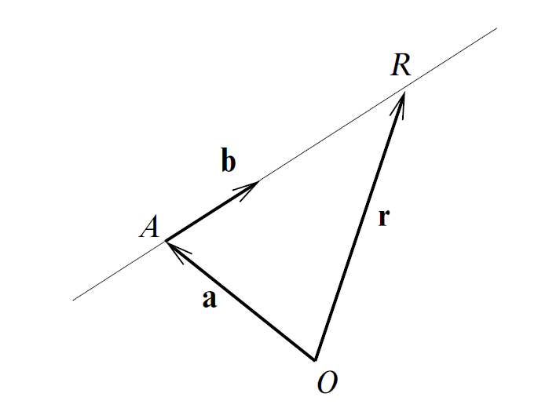
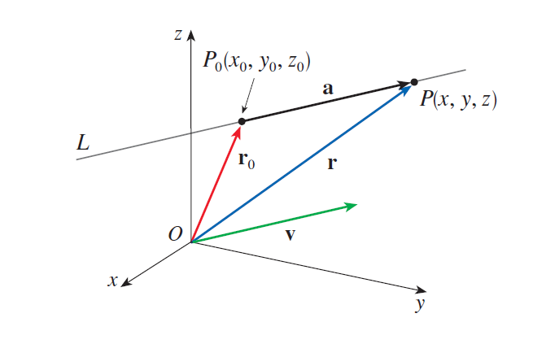
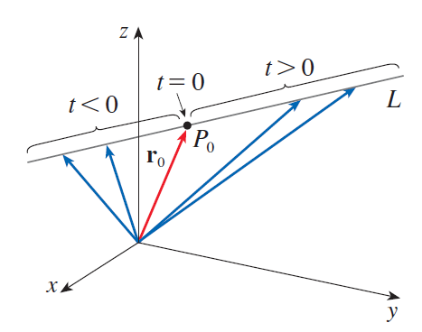

# Lines

## Equation of Lines

Knowing a point on a line and the direction of the line (the slope of the line in a 2-D plane), we can get an equation of the line in a 2-D plane using the point-slope form. A similar idea applies to lines in 3-D space. The key thing is that, with the knowledge of vectors, we have a powerful tool to "describe" the direction of the line. Just see the picture below:

<table style="border: none; width: 100%;">
  <tr style="border: none;">
    <td align="center" style="border: none;">
      
      
<em>Figure 1: 2-D Plane</em>

    </td>
    <td align="center" style="border: none;">
      
      
<em>Figure 2: 3-D Space</em>

    </td>
  </tr>
</table>

First, see Figure 1, we know a point $A$ on the line, then we know its direction described by the vector $\overrightarrow{b}$. Then we can actually represent any points on the line, say for the point $R$ we have $\overrightarrow{r} = \overrightarrow{a} + \lambda \overrightarrow{b}$ (here, we don't know the exact length of $AR$, so we don't know exactly the value of $\lambda$). For Figure 2, we know $P_0(x_0, y_0, z_0)$ and direction $\overrightarrow{v}$. Similarly, for point $P$, we have $\overrightarrow{r} = \overrightarrow{r_0} + 1 \overrightarrow{v}$.

From the Figure 3 below, it is not hard to deduce the so-called **vector equation** of a line $L$:

$$
\begin{equation}
\textbf{Vector Equation: }
\overrightarrow{r} = \overrightarrow{r_0} + t \overrightarrow{v}
\end{equation}
$$

    
    
<em>Figure 3: Vector Equation</em>

We call vector $\overrightarrow{v}$ the **direction vector** of the line.

If we have the coordinates of $\overrightarrow{r_0}$ and $\overrightarrow{v}$, say:

$$
\begin{equation*}
  \overrightarrow{r_0} =
  \begin{pmatrix}
      x_0 \\
      y_0 \\
      z_0
  \end{pmatrix} \quad
  \overrightarrow{v} =
  \begin{pmatrix}
      a \\
      b \\
      c
  \end{pmatrix} \quad \text{and denote } \overrightarrow{r} =
  \begin{pmatrix}
      x \\
      y \\
      z
  \end{pmatrix}
\end{equation*}
$$

Thus, we can rewrite the vector equation of the line as:

$$
\begin{equation*}
  \begin{pmatrix}
      x \\
      y \\
      z
  \end{pmatrix} =
  \begin{pmatrix}
      x_0 \\
      y_0 \\
      z_0
  \end{pmatrix} +
  t
  \begin{pmatrix}
      a \\
      b \\
      c
  \end{pmatrix} =
  \begin{pmatrix}
      x_0 + ta \\
      y_0 + tb \\
      z_0 + tc
  \end{pmatrix}
\end{equation*}
$$

Here we get the so-called **parametric equations of the line $L$** through the point $P_0(x_0, y_0, z_0)$ and parallel to the vector $\overrightarrow{v}$:

$$
\begin{equation}
  \text{Parametric Equations: }
  \begin{cases}
      x = x_0 + ta \\
      y = y_0 + tb \\
      z = z_0 + tc
  \end{cases}\tag{1.2}
\end{equation}
$$

Another way of describing a line $L$ is to eliminate the parameter $t$ from Equations $(1.2)$. If none of $a$, $b$, or $c$ is $0$, we can solve each of these equations for $t$:

$$
\begin{equation*}
  t = \frac{x - x_0}{a} = \frac{y - y_0}{b} = \frac{z - z_0}{c}
\end{equation*}
$$

Here we actually get the so-called **symmetric equations** of $L$:

$$
\begin{equation}
\text{Symmetric Equations: } \frac{x - x_0}{a} = \frac{y - y_0}{b} = \frac{z - z_0}{c}\tag{1.3}
\end{equation}
$$

Actually, we "allow" the denominators to be $0$. See Equation $(1.2)$ again, for example, if $a = 0$, it just means that $x = x_0$ all the time or, more geometrically, this means that $L$ lies in the vertical plane $x = x_0$.

As you can see, the components of the direction vector of the line $L$ can be seen from the denominator of the symmetric equations. The question is how do we know the direction vector? Sometimes it will be given, but sometimes it won't. In the second case, we can get it from knowing another point on the line, say $P_1(x_1, y_1, z_1)$, and $\overrightarrow{P_0P_1}$ will be the direction vector, so we get:

$$
\begin{equation}
\frac{x - x_0}{x_1 - x_0} = \frac{y - y_0}{y_1 - y_0} = \frac{z - z_0}{z_1 - z_0}\tag{1.4}
\end{equation}
$$

We have been learning the formula for lines in 3-D space, but they can also be applied in a 2-D plane, just ignoring the part of $z$.

But, in 2-D plane, this raises a question: how can we get from those equations above to the familiar formula of a line in a 2-D plane such as $y = mx + c$? And the inverse question: how do we get from $y = mx + c$ to the equations above? Ah, this topic is a little bit lengthy, so if you are interested in it, I recommend you to read a book to find it out: *Introduction to Linear Algebra* (2nd ed.) by Serge Lang, the related content is on pages 32 to 33.

I usually have the need to draw a **line segment** in the coordinate system in web-based tools like Geogebra, so I want to show you how to do this. Suppose we know two points on the line, say $P$ and $Q$. For convenience, we denote the vectors from the origin to these two points as $\overrightarrow{P}$ and $\overrightarrow{Q}$. Then the line segment can be denoted by:

$$
\begin{equation*}
  \overrightarrow{S}(t) = \overrightarrow{P} + t(\overrightarrow{Q} - \overrightarrow{P}), \quad 0 \le t \le 1
\end{equation*}
$$
